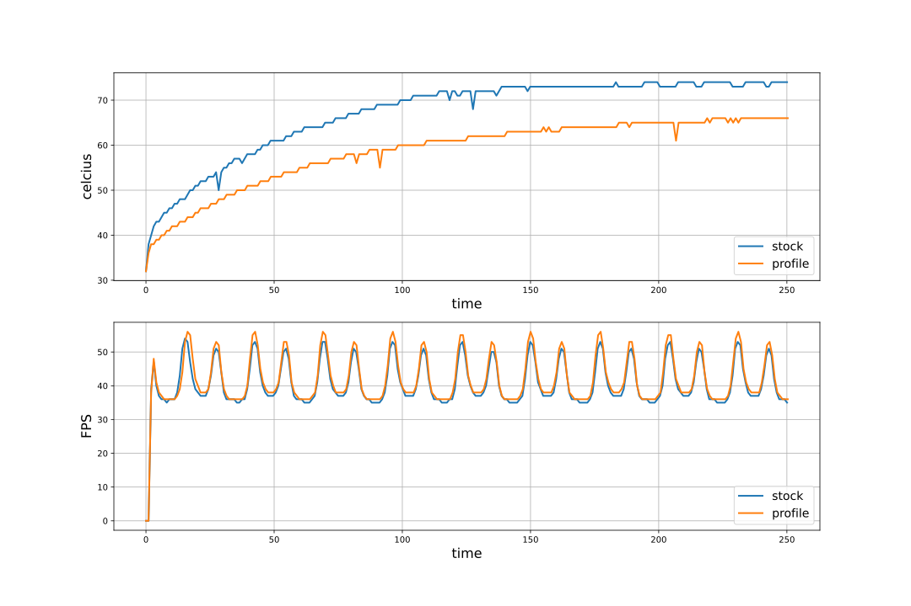

# Undervolt
## GPU GTX 1060 3GB Dual Palit

Reducing the voltage on the video card from 1.050 to 0.893 mV

All data was taken from the logs recorded by the furmark program

|           | Stock | Profile |
|:---------:|:-----:|:-------:|
|    FPS    | 40.64 |  41.81  |
| Tempature | 67.15 |  58.72  |

Decrease in temperature AVG 8.419354838709687

